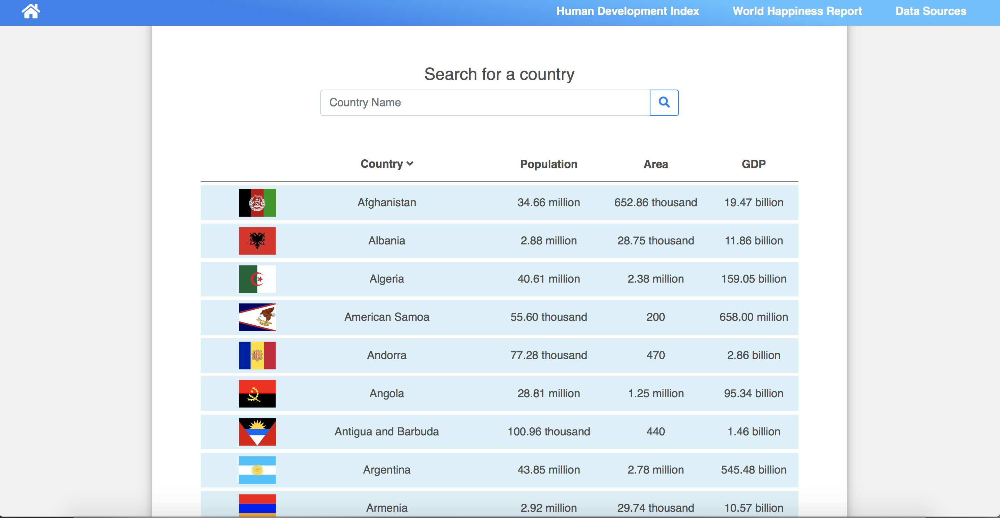
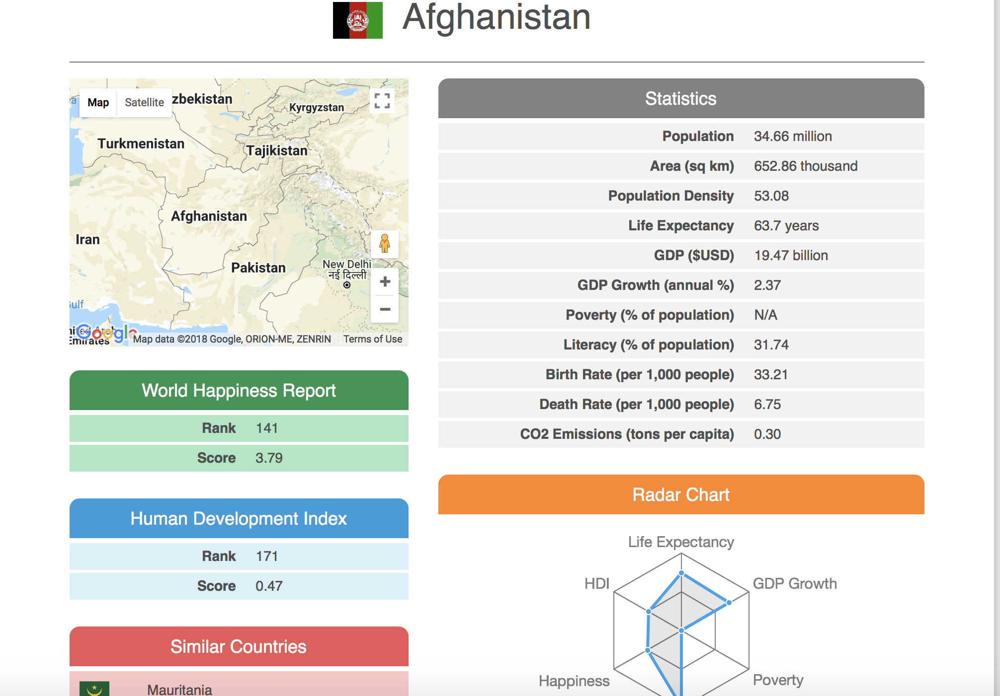
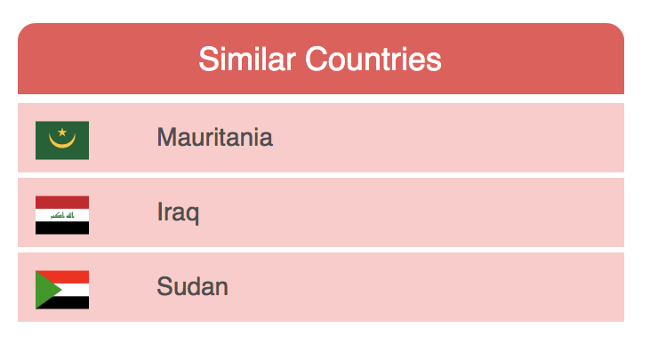

# Countries

The purpose of this project is to demonstrate knowledge in creating Web Applications, both in backend and frontend.

The project's main idea is simple, display all countries basic data, and if we click on the country, it will show more data about the country. The web application also integrate Machine Learning algorithm to recommend similar countries.

## Front Page / Index

Homepage of our countries web application.

## Country Profile

Countries Profile, with radar chart embedded, and map API.

## Machine Learning - K nearest neighbour

Calculate the 3 most similar country to the chosen country based on the statistics displayed here.
